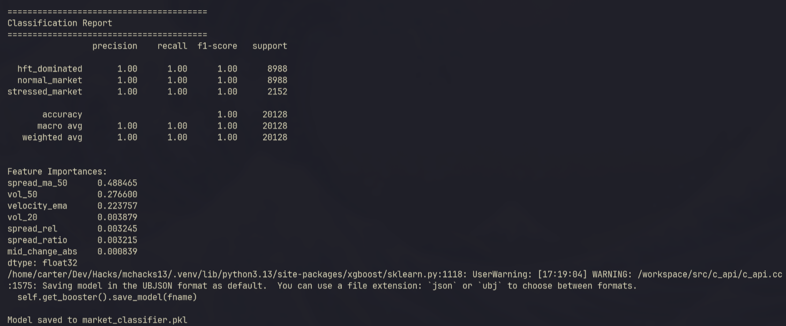
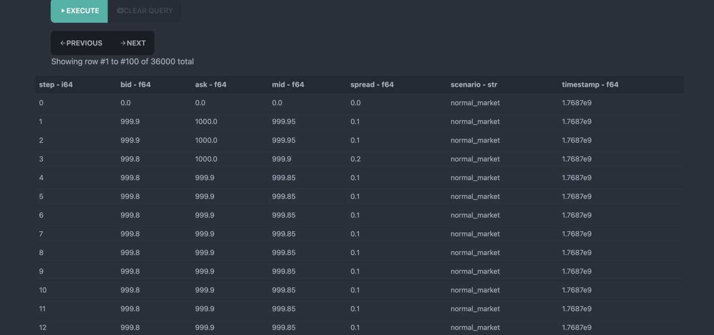
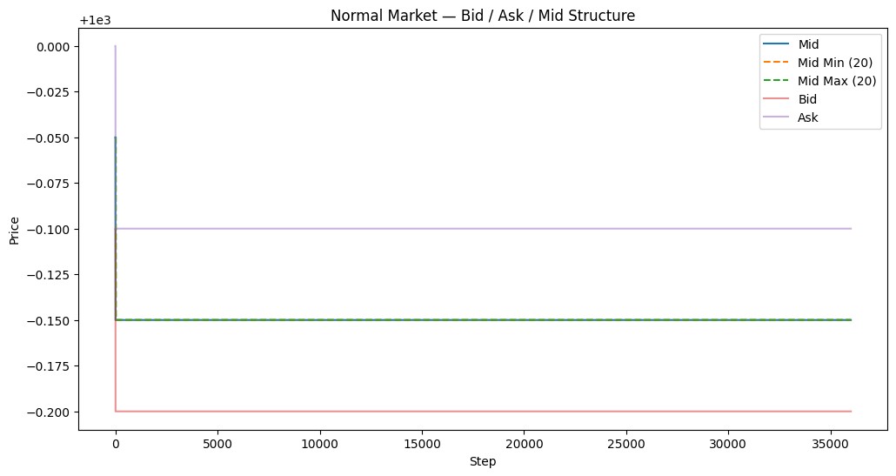
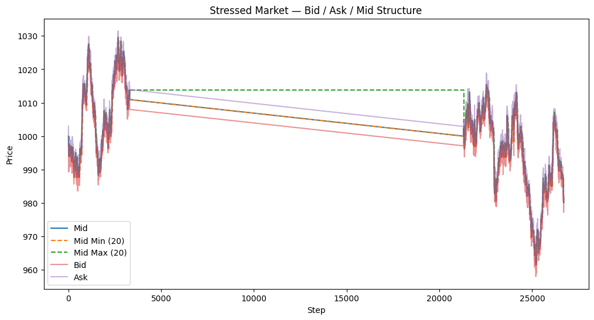
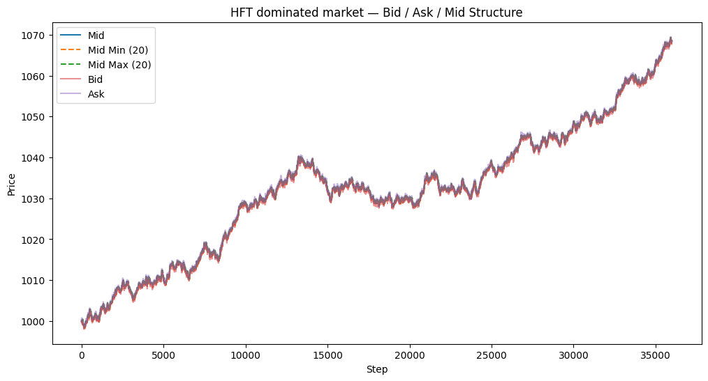
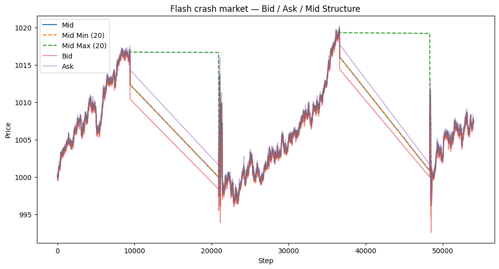
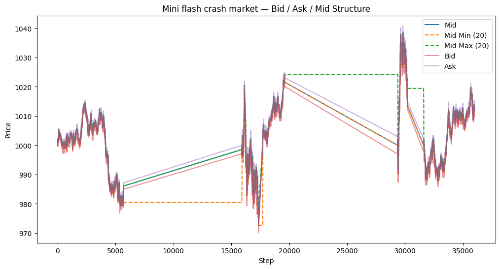

# Market Wizard

## Overview

Financial markets constantly shift between different regimes; calm, volatile, stressed, or dominated by high-frequency trading. Trading strategies that perform well in one regime often fail catastrophically in another.

Market Wizard is a real-time market intelligence system that classifies market regimes using microstructure signals instead of attempting unreliable price prediction.

Rather than forecasting prices, Market Wizard answers a more important question:

What kind of market are we trading in right now?

This enables safer, adaptive trading systems that respond to instability before losses occur.

## Features

- Real-time ingestion of bid/ask market data
- Microstructure feature engineering
- Market regime classification using XGBoost
- Supports multiple regimes:
    - Normal market
    - Stressed market
    - HFT-dominated market
    - Flash events

We use an XGBoost multi-class classifier trained on engineered microstructure features.

Key design choices:

- Relative features instead of absolute prices
- Rolling statistical features
- Regime classification instead of price prediction
- This produces highly stable and explainable results.

## Findings

During development and live testing, we uncovered two important market microstructure flaws in the simulation environment. Identifying and adapting to these behaviors became a critical part of our strategy design.

### 0 values in markets

The 0 sections seem to be either intentional as an obstacle for participants or an error in the synthetic data generation

### Normal market structure

The reason the normal market making regime has such right returns is we essentially have a monopoly on market making. The market making bots seem to have a set interval they can trade on, around $0.25. This means if we move our bid and ask prices slightly inside of that we can infinitely sell back and forth between the gridlocked bots.

The data in the normal period was literally the same for all rows except for the 4th row which showed a clear mean reversion opportuinity on the spread.

### Graph representation of the data

We logged the data in order to visualize it, and this is what we found per scenario. The *spaces* in the graphs are due to all zero rows.

## Authors

- Dan Moraru
- Carter Cameron
- Samuel Beaudoin
- Shuya Liu